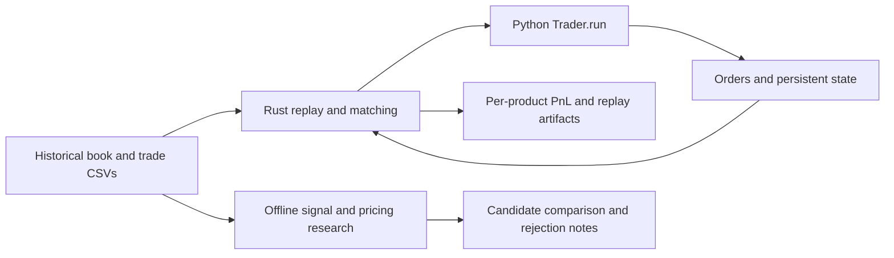

# IMC Prosperity 4: trading strategies and replay research

A team research workspace for [IMC's Prosperity 4 trading competition](https://prosperity.imc.com/):
Python market makers, voucher-pricing research, counterparty signals and a Rust
harness that runs the same `Trader.run(state)` interface as the competition.
The interesting problem is deciding which apparent statistical edges survive
inventory limits, executable prices and an imperfect local fill model.

Start with the [Round 4 submission](submissions/r4_final_v01_imc_upload.py), the
[matching engine](prosperity_rust_backtester/src/runner.rs) and the
[post-competition numerical review](docs/NUMERICAL_REVIEW.md). Together they show
the strategy, its execution assumptions and the checks behind the research tools.

## What was built

The submitted Round 4 trader combines three related problems:

- **Market making in two underlying products.** HYDROGEL_PACK blends a 10,000
  anchor with a volume-wall estimate. VELVETFRUIT_EXTRACT uses the midpoint of
  sufficiently large resting levels, with an autocorrelation adjustment and
  bounded order-book-imbalance skew. Quote sizes and taking thresholds depend
  on remaining inventory capacity.
- **Pricing ten call vouchers.** A quadratic smile in log-moneyness provides
  strike-dependent fair values; time-to-expiry priors, per-strike biases and a
  small adaptive ATM component stabilize the fit. Deep in-the-money vouchers
  also have an accumulation overlay. These are empirical competition models,
  not an arbitrage-free volatility-surface calibration.
- **Using disclosed counterparties.** A decaying state variable adjusts quotes
  after selected Mark buyer/seller prints. The final file excludes Mark 67:
  its apparently useful historical behavior did not survive the recorded null
  checks. The precise signs and weights are in `_update_mark_lean`; the signal
  is more specific than simply copying every profitable participant.

The trader is a single standard-library Python file with JSON state carried in
`traderData`. This makes upload and recovery straightforward, at the cost of
repeated helpers across historical variants. Research code is kept separately
so a notebook dependency cannot accidentally enter the submission.



The Rust/PyO3 boundary loads a Python trader, constructs the competition data
model and calls it on each tick. Orders cross visible depth first; remaining
orders may match historical prints under a configurable queue approximation.
The next invocation receives the previous tick's public and own trades.
Using Rust keeps replay orchestration separate from submission code, but does
not make the simulated exchange identical to IMC's engine.

## Results and what they establish

The following replay was rerun on 8 September 2026 with the unchanged submission,
independent daily starting states and default matching settings:

| Round 4 dataset | Ticks | Own trade records | Local final marked PnL |
|---|---:|---:|---:|
| Day 1 | 10,000 | 1,300 | 68,985.50 |
| Day 2 | 10,000 | 1,285 | 110,025.50 |
| Day 3 | 10,000 | 1,195 | 49,499.50 |
| Sum of independent days | 30,000 | 3,780 | 228,510.50 |

These reproduce the numbers recorded in the submission header. They are
**development-set replay results**, not out-of-sample returns or official
competition PnL. Day 3 is particularly instructive: HYDROGEL contributes
57,417 while VELVETFRUIT and several vouchers lose money. The aggregate hides
material variation by product.

There is an expiry caveat behind that reproduction. The retained upload fixes
`START_TTE_DAYS=7`, so independent day-2/day-3 runs reuse seven days. The
[transcribed Round 4 briefing](docs/competition/context/new_context/round_4_trading_round.md#voucher--tte-rules)
records a 7/6/5 historical schedule and four days at the start of live Round 4.
CSV day labels alone do not establish expiry and that transcription was not
reverified against a live competition portal during this review.

An explicit post-competition sensitivity run changes **only** the starting-TTE
literal, leaving the archived file untouched:

| Dataset | Documented starting-TTE assumption | Local PnL with that assumption |
|---|---:|---:|
| Day 1 | 7 | 68,985.50 (same as archive) |
| Day 2 | 6 | 89,936.00 |
| Day 3 | 5 | 56,170.00 |
| Sum | | 215,091.50 |

The difference from 228,510.50 is material. It is not a new alpha result or a
retroactive change to the submission: it shows why contract-time assumptions
must accompany a derivatives backtest. [`scripts/replay_round4.py`](scripts/replay_round4.py)
saves the configured source and a hash/parameter manifest; run
`python3 scripts/replay_round4.py --day 2` (or `--day 3`) from the root.
[Review evidence](docs/verification/2026-09-08.json) records both sets of metrics.

The retained team standing is top 32 in manual trading and top 20 in the UK
after Rounds 1 and 2. That is an interim result, not a final overall placing.
No final-placement claim is made here.

The research includes permutation/shuffle checks and notes rejecting some
candidate signals. It also contains repeated feature and parameter selection
on a small set of days. Those tests help diagnose a hypothesis; they cannot
remove selection bias from reusing the same historical data. Horizon mark-outs
measure later mids relative to trade prices, not attainable strategy returns.

## Run the reviewed paths

The core replay needs Rust and a linkable Python installation; the pricing and
bid-model checks use the Python standard library. Python 3.11 is the CI baseline.
Run these commands from the repository root:

```bash
python3 -m unittest discover -s tests -v
make -C prosperity_rust_backtester test

cd prosperity_rust_backtester
make round4 TRADER=../submissions/r4_final_v01_imc_upload.py DAY=1 PRODUCTS=full
```

Change `DAY=1` to `2` or `3` to reproduce the table. Always select both trader
and dataset explicitly: filesystem modification times and the newest populated
round are poor experiment identifiers. Each run writes `metrics.json` and a
submission-style log under `prosperity_rust_backtester/runs/`. See the
[replay guide](prosperity_rust_backtester/README.md) for matching controls and
artifact modes.

Other small entry points, from the root:

```bash
python3 prosperity_rust_backtester/scripts/round4_options/bs.py
python3 prosperity_rust_backtester/scripts/round4_options/exotic_pricers.py --spot 40 --sigma 0.20
python3 round3_manual_research/bids.py
python3 prosperity_rust_backtester/scripts/round4_options/counterparty_scan.py --out-dir /tmp/prosperity-counterparties
```

For notebooks and broader statistical analysis, `environment.yml` describes the
larger Conda environment. It is optional for the commands above.

## Research beyond the submitted trader

| Area | Entry point | What to inspect |
|---|---|---|
| Options mathematics | [Round 4 tools](prosperity_rust_backtester/scripts/round4_options/) | Call/put valuation, bracketed IV inversion, smile residuals and manual exotics |
| Counterparty analysis | [Headline findings](prosperity-research/03_eda/round4/headline_findings.md) | Historical mark-outs, identity hypotheses and where the final submission differs |
| Validation decisions | [Signal notes](prosperity-research/04_signal_notes/round4/) | Rejected candidates, null checks and recorded execution concerns |
| Round 3 manual bids | [Bid-model explanation](round3_manual_research/README.md) | Exact reserve-grid EV and sensitivity to assumed opponent behavior |
| Round 5 exploration | [Round 5 diagnostic](prosperity_rust_backtester/traders/Round5/README.md) | Basket residuals and a rejected positive-correlation gate on negatively correlated products |
| Earlier rounds | [Archive](archive/round1_round2/) | Previous product families and development history |
| Hosted observations | [Official replay archive](official_replays/) | Retained portal outputs for comparison, distinct from local replay |

The numerical review found and corrected an IV bisection error, the knockout-put
formula and rate-sensitive deterministic limits. It also fixed censored
counterparty mark-outs, added checked Round 5 caps for the implemented product
subset and removed fabricated default limits for unknown products. The bid
notebooks now have a corrected deterministic companion. Those improvements are
dated **after** the competition; submitted files and historical notebook outputs
remain unchanged. CI runs the numerical and replay tests on future changes.

## Limitations and the next defensible experiment

The fill model approximates queue position and does not model impact, latency,
fees, settlement or conversion cash flows. Nonzero conversions fail explicitly.
Unknown position limits reject orders; Round 5 caps are currently defined only
for the PEBBLES and SNACKPACK products implemented here. A missing mid carries the last observed mark; an unmarked open position fails
explicitly. Stale marks are not evidence of executable liquidation value.

The next useful strategy experiment is a chronological holdout with a frozen
candidate set and fill-model sensitivity, followed by comparison against hosted
replays. Voucher results additionally need expiry/settlement checks and PnL
attribution across underlying and option exposure. A larger parameter sweep on
the same three days would provide less convincing evidence.

## Team and provenance

This is collaborative work by Muhammad Taha
([@TahaKhanM](https://github.com/TahaKhanM)), Andy Si
([@andy586586](https://github.com/andy586586)), Arham Shuaib
([@javaxhaskell](https://github.com/javaxhaskell)), Mahmoud Khoder
([@Mkhod51](https://github.com/Mkhod51)) and Ryan Whalen. Taha's recorded work
includes workspace/replay integration, Round 4 counterparty and options research,
strategy iteration and the later engineering review. Contributions overlap;
the commit history and `.mailmap` preserve individual attribution.

The Rust harness is adapted from
[GeyzsoN/prosperity_rust_backtester](https://github.com/GeyzsoN/prosperity_rust_backtester),
not an entirely original backtester. The tools under `vendor/` adapt
[Jasper van Merle's backtester](https://github.com/jmerle/imc-prosperity-3-backtester)
and visualizer. Their notices remain with the source. Competition instructions,
datasets and historical agent-workflow notes are retained for provenance and
should not be mistaken for maintained application entry points.
